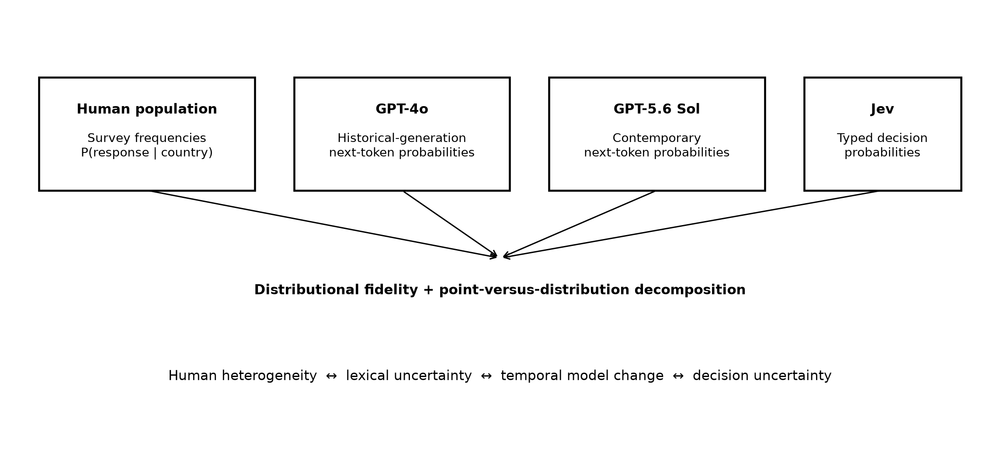
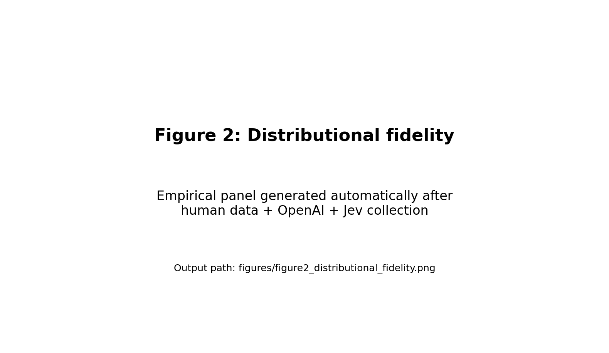
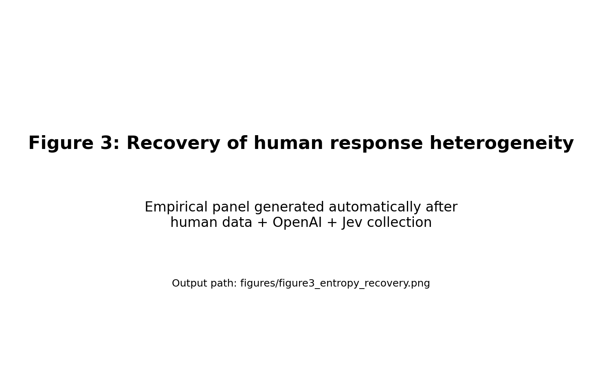
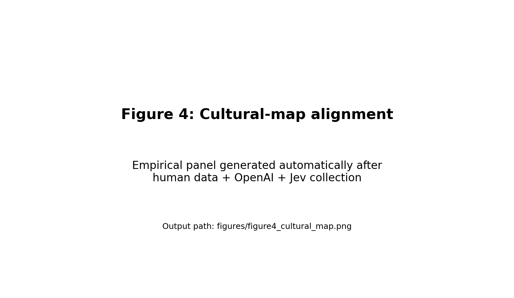

# Do AI probability distributions represent human population variation?

**Token uncertainty, decision uncertainty, and cross-cultural survey responses**

**Author(s):** [To be finalised]

**Affiliations:** [To be finalised]

**Corresponding author:** [To be finalised]

**Draft status note (remove before submission):** Numerical result fields marked `<<AUTO:...>>` are intentionally unfilled. They are populated from the supplied analysis pipeline only after the licensed IVS files and authenticated OpenAI/Jev API runs are available. No empirical results have been invented for this draft.

## Abstract

Large language models are increasingly used as synthetic respondents, yet the statistical meaning of an AI probability is unclear. We compare nationally representative human response distributions with three principal model conditions spanning two probability interfaces: GPT-4o and GPT-5.6 Sol next-token probabilities, and Jev direct typed decision probabilities. Using the ten survey constructs underlying the Inglehart-Welzel World Cultural Map across more than 100 societies, we reproduce country prompting and extend point-response evaluation to distributional fidelity. We distinguish lexical uncertainty, decision uncertainty, and between-person population heterogeneity, and evaluate them using divergence, transport, expected-score, entropy, and robustness measures. **[EMPIRICAL RESULTS AUTO-POPULATE AFTER EXECUTION.]** The framework tests when model uncertainty can meaningfully approximate population variation rather than assuming that any model probability is a human-frequency estimate.

**Keywords:** large language models; synthetic respondents; probability; cultural values; survey simulation; calibration

## Significance Statement

AI systems can now return an entire probability distribution rather than a single survey answer. This creates an attractive shortcut for synthetic-population research: one probabilistic model call might appear to represent the distribution of many people. But next-token probabilities, decision probabilities, and disagreement among humans are different statistical objects. We test whether they coincide empirically using nationally representative cultural-value surveys. The study shifts evaluation from asking whether AI selects a plausible answer to asking whether its full uncertainty reproduces the shape and diversity of human responses. This distinction matters for synthetic surveys, behavioral simulation, market research, and other applications in which model probabilities may be interpreted as population frequencies.

## Introduction

Large language models (LLMs) are increasingly used not only to generate text but also to stand in for people. Researchers have asked models to answer surveys, simulate experimental participants, approximate subgroup attitudes, and anticipate aggregate experimental effects (1-4). These applications create a distinctive measurement problem. When a model is instructed to respond as an “average person” from a population, what exactly should its output represent: the response of a modal individual, the expected response of the population, or the full distribution of heterogeneous responses within that population?

Most synthetic-respondent studies have historically observed one generated answer at a time. A model is prompted with a question and a persona or population descriptor, samples or selects a response, and those responses are aggregated in the same way as observations from people. This procedure is intuitive, but it conflates two sources of variation. Variation across repeated model calls can arise from the model’s stochastic decoding process, whereas variation across human survey respondents arises from differences among people as well as within-person uncertainty and measurement error. Repeating an AI model does not by itself establish that the resulting distribution corresponds to a population distribution.

Recent work has begun to evaluate the distribution itself. First-token probabilities can be extracted from language models and compared with empirical response frequencies, and models can be specialized explicitly to predict group-level survey distributions (5). In a different domain, log-probability and Monte Carlo estimates have been compared with human disagreement distributions, revealing substantial failures when disagreement is high (6). At the same time, survey-based evaluations have documented strong effects of answer ordering and labels, emphasizing that a model’s apparent population alignment can partly reflect properties of the elicitation interface rather than stable social representation (7). These findings make probability-aware evaluation important, but they also expose a conceptual ambiguity: a probability generated by a language model is not automatically a probability over people.

The distinction can be written formally. Let a human population in country or territory c contain heterogeneous latent states theta distributed according to F_c(theta). For survey item q with response Y, the population distribution is

H(y | c, q) = integral P(y | theta, q) dF_c(theta).

This is a distribution across people. By contrast, an autoregressive language model exposes a conditional distribution over its next textual token,

O(t | prompt),

and, after restricting the output vocabulary to labels that encode survey alternatives, this can be transformed into a conditional choice distribution O(y | prompt). A decision-native model instead exposes a probability directly over declared outcomes,

J(y | state, alternatives).

The three distributions have matching support only after an elicitation design maps model outputs to survey responses. Their meanings remain different. Equality between model uncertainty and population heterogeneity is therefore an empirical hypothesis, not a definitional property of probabilistic AI.

This distinction has become testable because contemporary systems expose different probability interfaces. OpenAI’s Responses API can return log probabilities for generated tokens and up to 20 likely alternatives at each output position (8). By assigning each survey response a controlled single-token label, one can recover and renormalize the model’s next-token probability mass across permitted answers. TypeSafe’s Jev System One model provides a contrasting interface: users declare typed questions and allowed choices, and the API returns a probability for every declared alternative directly rather than requiring the model to generate a textual probability report (9). TypeSafe describes Jev as optimized for calibrated decisions and parallel structured outputs. These are vendor claims about the model’s intended design, not assumptions in our analysis; our comparison concerns observable output distributions.

The comparison is theoretically informative even if neither system perfectly represents humans. OpenAI probabilities are lexical in origin: they reflect the relative likelihood of output tokens under a generative model and can inherit tokenization, labeling, and prompt effects. Jev probabilities are decision-native: the declared outcome set is the model’s output space for that question. Human survey distributions, meanwhile, describe population heterogeneity. If both machine distributions closely track human response frequencies, this would support the possibility that model uncertainty can contain useful information about between-person variation despite different semantics. If one interface systematically tracks human distributions more closely, it would show that probability elicitation is not merely a formatting choice. If both collapse around a modal answer while humans remain heterogeneous, it would caution against treating a model’s uncertainty as a synthetic population.

We evaluate these possibilities using a demanding cross-national benchmark. The Integrated Values Surveys (IVS), combining the World Values Survey (WVS) and European Values Study (EVS), provide nationally representative responses across a large set of societies. Ten survey constructs underlie the Inglehart-Welzel World Cultural Map, spanning happiness, interpersonal trust, authority, political participation, religion, moral values, national pride, materialist/post-materialist goals, and child-rearing autonomy (1,10-12). Prior model evaluation with these items found that point responses could be projected into the same cultural space as human data and that country-specific cultural prompting often reduced distance from national survey coordinates (1). The present study preserves that replication target but changes the unit of evaluation from a single selected answer to the complete probability vector whenever the response space permits it.

The study makes three contributions. First, it provides a measurement framework that separates **lexical uncertainty**, **decision uncertainty**, and **population heterogeneity** rather than treating all three as interchangeable “confidence.” Second, it extends cross-cultural model evaluation from point estimates to distributional fidelity, including whether models reproduce the amount of within-country disagreement rather than only national means or cultural-map coordinates. Third, it provides a model-agnostic benchmark and open replication pipeline that can be reused as new probabilistic interfaces become available. The current comparison uses GPT-4o as a historical-generation anchor, GPT-5.6 Sol as the primary contemporary autoregressive model, and Jev as a decision-native model; together they form a test case for a broader question: **when an AI system is uncertain, does that uncertainty describe the people it is supposed to represent?**

We preregister one primary and three secondary questions. **RQ1 (distributional fidelity):** How closely do GPT-4o, GPT-5.6 Sol, and Jev probability distributions match national human response distributions? **RQ2 (representation):** Within each model, how much fidelity is gained by retaining the full distribution rather than collapsing it to its argmax response? **RQ3 (model generation and probability semantics):** How much changes from GPT-4o to GPT-5.6 Sol under the same logprob method, and how does GPT-5.6 Sol differ from Jev under a decision-native interface? **RQ4 (robustness and cultural geometry):** How sensitive are these conclusions to prompt/label/order manipulations, and do full distributions change cultural-map alignment relative to point responses?

**Figure 1. Probability semantics compared in the study.** Human survey frequencies, OpenAI next-token probabilities, and Jev typed decision probabilities share a probability-vector representation but refer to different statistical objects. The empirical analysis tests how GPT-4o, GPT-5.6 Sol, and Jev recover the human population distribution and whether conclusions depend on retaining full uncertainty.

## Results

### Replication sample and probability recovery

The human benchmark contained **<<AUTO:N_COUNTRIES>>** countries/territories with valid observations for at least one primary distributional item and **<<AUTO:N_COUNTRY_ITEM>>** matched country-item cells for the main paired comparison. The strict cultural-map replication used the same ten IVS constructs and the same wave-selection logic as the source study. Human distributions were calculated within country-year using survey weights and then averaged across available country-years.

OpenAI probability calls used controlled single-token labels and requested the maximum prespecified set of alternative token probabilities. Across all primary calls, the mean pre-renormalization probability mass assigned to permitted labels was **<<AUTO:OPENAI_ALLOWED_MASS>>**, and **<<AUTO:OPENAI_MISSING_RATE>>%** of calls omitted at least one permitted label from the returned top-logprob set. The primary distributional analysis **<<AUTO:OPENAI_COMPLETENESS_ACTION>>**; the maximum request-level omitted permitted-label mass upper bound was **<<AUTO:OPENAI_MAX_MISSING_MASS_UB>>**. Stricter 0.0001 and complete-only censoring policies are reported as sensitivity analyses. Jev returned a declared probability for each permitted Choice alternative by construction. API model identifiers and collection dates are reported in Table S1.

### Distributional fidelity to human responses

Across the nine constructs with fully comparable finite response distributions, mean Jensen-Shannon divergence from human response frequencies was **<<AUTO:OPENAI_JS_MEAN>>** for OpenAI next-token probabilities and **<<AUTO:JEV_JS_MEAN>>** for Jev decision probabilities (Fig. 2; Table 2). The paired OpenAI-minus-Jev difference was **<<AUTO:JS_DIFF>>** (95% crossed-bootstrap CI **<<AUTO:JS_CI_LOW>>** to **<<AUTO:JS_CI_HIGH>>**; paired Wilcoxon robustness P = **<<AUTO:JS_WILCOXON_P>>**), indicating **<<AUTO:PRIMARY_DIRECTION>>** average divergence.

The same comparison using total variation distance yielded mean errors of **<<AUTO:OPENAI_TV_MEAN>>** and **<<AUTO:JEV_TV_MEAN>>**, respectively. For ordered scales, normalized Wasserstein distance was **<<AUTO:OPENAI_WASS_MEAN>>** for OpenAI and **<<AUTO:JEV_WASS_MEAN>>** for Jev. Item-level results were heterogeneous: the largest between-system difference occurred for **<<AUTO:LARGEST_DIFF_ITEM>>**, whereas **<<AUTO:SMALLEST_DIFF_ITEM>>** showed little separation (Table S2). These differences are descriptive of the complete model systems, not causal estimates of the effect of output architecture, because the systems also differ in pretraining, post-training, and model capacity.

**Figure 2. Distributional fidelity of GPT-5.6 Sol next-token and Jev decision probabilities.** Each point is one matched country x item cell. The x-axis shows Jensen-Shannon divergence between the human distribution and the GPT-5.6 Sol distribution; the y-axis shows the corresponding Jev divergence. The historical GPT-4o anchor and all-condition summaries are reported in accompanying tables and supplementary figures. The figure is generated by `src/figures.py` after empirical execution.

### Do model probabilities recover human heterogeneity?

Matching a population mean does not require matching population disagreement. We therefore compared normalized entropy and the effective number of response categories. Human distributions had mean normalized entropy **<<AUTO:HUMAN_ENTROPY_MEAN>>**. The mean absolute entropy error was **<<AUTO:OPENAI_ENTROPY_ERROR>>** for OpenAI and **<<AUTO:JEV_ENTROPY_ERROR>>** for Jev. The slope of model entropy on human entropy was **<<AUTO:OPENAI_ENTROPY_SLOPE>>** for OpenAI and **<<AUTO:JEV_ENTROPY_SLOPE>>** for Jev (Fig. 3).

A slope below one together with a negative intercept-adjusted entropy difference indicates distributional compression: the model changes less than humans as disagreement increases and tends to concentrate mass too strongly. Conversely, a slope above one indicates over-dispersion relative to human populations. The observed pattern was **<<AUTO:ENTROPY_INTERPRETATION>>**. These results directly test the assumption that uncertainty within one model call can substitute for heterogeneity across people.

**Figure 3. Recovery of human response heterogeneity.** Normalized entropy of the human survey distribution is plotted against normalized entropy of the model distribution for matched country-item cells. The 45-degree line represents exact recovery. Provider-specific regression summaries and item-stratified plots are reported in Fig. S3.

### Prompt, label, and option-order sensitivity

Across the ten respondent descriptors, prompt sensitivity is estimated separately for GPT-4o, GPT-5.6 Sol, and Jev (Fig. S2), with condition-specific values populated automatically after execution. Rotating label assignments altered OpenAI probabilities by **<<AUTO:LABEL_EFFECT>>**, while randomized option-order tests altered distributions by **<<AUTO:ORDER_EFFECT_OPENAI>>** for OpenAI and **<<AUTO:ORDER_EFFECT_JEV>>** for Jev (Table S4). These diagnostics distinguish substantive country variation from interface-induced variation.

### Cultural alignment with full probability information

We next mapped each model’s expected item scores into the human-fitted two-dimensional cultural space. Expected scores retain the full probability vector rather than selecting only the highest-probability answer. The mean country-specific Euclidean distance from human coordinates was **<<AUTO:OPENAI_MAP_DISTANCE>>** for OpenAI and **<<AUTO:JEV_MAP_DISTANCE>>** for Jev. Relative to the argmax/point-response replication, retaining probability information changed mean cultural distance by **<<AUTO:OPENAI_MAP_CHANGE>>** for OpenAI and **<<AUTO:JEV_MAP_CHANGE>>** for Jev (Fig. 4; Table 3).

The Y003 autonomy construct requires special treatment because the original question permits up to five selections from eleven qualities, yielding a response space too large for a single exhaustive top-logprob or Jev Choice call. We therefore estimated the four marginal selection probabilities that determine its expected index: Independence, Determination/perseverance, Religious faith, and Obedience. Mean absolute error in these four marginals was **<<AUTO:OPENAI_Y003_MAE>>** for OpenAI and **<<AUTO:JEV_Y003_MAE>>** for Jev (Table S5). Because the expected autonomy index is linear in these four indicators, its expected value can be computed without assuming independence among selections; however, the complete Y003 joint response distribution is not recovered and is not included in the primary distributional divergence analysis.

**Figure 4. Cultural-map alignment using expected model responses.** Human country/territory coordinates are obtained from the IVS replication. Country-prompted GPT-4o, GPT-5.6 Sol, and Jev coordinates are projected using the same human-derived standardization and factor-scoring transformation. The main panel reports human and model coordinates; the inset summarizes country-level Euclidean distances. Generated after empirical execution.

### Table 1. Statistical objects compared in the study

| Source | Probability object | Unit represented | Output support | Primary interpretation |
|---|---|---|---|---|
| Human IVS | Survey-weighted response frequency | People within a country/territory | Survey response categories | Population heterogeneity |
| OpenAI | Renormalized next-token probability | One generative model conditional on a prompt | Controlled single-token labels | Lexical/generative uncertainty conditional on allowed labels |
| Jev | Direct typed Choice probability | One decision model conditional on state and choices | Declared decision alternatives | Decision uncertainty |

### Table 2. Primary distributional fidelity

| Metric | OpenAI | Jev | Paired OpenAI - Jev difference (95% CI) |
|---|---:|---:|---:|
| Jensen-Shannon divergence | <<AUTO:OPENAI_JS_MEAN>> | <<AUTO:JEV_JS_MEAN>> | <<AUTO:JS_DIFF>> (<<AUTO:JS_CI_LOW>>, <<AUTO:JS_CI_HIGH>>) |
| Total variation distance | <<AUTO:OPENAI_TV_MEAN>> | <<AUTO:JEV_TV_MEAN>> | <<AUTO:TV_DIFF_CI>> |
| Normalized Wasserstein distance | <<AUTO:OPENAI_WASS_MEAN>> | <<AUTO:JEV_WASS_MEAN>> | <<AUTO:WASS_DIFF_CI>> |
| Absolute expected-score error | <<AUTO:OPENAI_EXPECTED_ERROR>> | <<AUTO:JEV_EXPECTED_ERROR>> | <<AUTO:EXPECTED_DIFF_CI>> |
| Absolute normalized-entropy error | <<AUTO:OPENAI_ENTROPY_ERROR>> | <<AUTO:JEV_ENTROPY_ERROR>> | <<AUTO:ENTROPY_DIFF_CI>> |

### Table 3. Cultural-map alignment

| Output representation | OpenAI mean distance | Jev mean distance |
|---|---:|---:|
| Argmax/modal point response | <<AUTO:OPENAI_ARGMAX_MAP>> | <<AUTO:JEV_ARGMAX_MAP>> |
| Expected-score probability representation | <<AUTO:OPENAI_MAP_DISTANCE>> | <<AUTO:JEV_MAP_DISTANCE>> |

## Discussion

The purpose of this study is not to crown a new model architecture. It is to clarify what is being measured when AI probabilities are used as synthetic social data. Human response frequencies, language-model token probabilities, and decision-model probabilities can all be represented as vectors that sum to one, but that shared mathematical form does not make them equivalent. A population distribution integrates variation across people; a token distribution represents uncertainty in a generative continuation; and a decision distribution represents uncertainty over explicitly declared outcomes. Treating these objects as interchangeable is an empirical assumption that should be tested wherever probabilistic AI is used to stand in for human populations.

The primary results show **<<AUTO:DISCUSSION_PRIMARY>>**. Whatever the direction of the model comparison, two interpretations must be separated. If Jev is closer to human distributions, the result is consistent with the possibility that decision-native probability training or typed output spaces are beneficial for population-distribution recovery, but it cannot isolate that mechanism because Jev and the OpenAI comparator are different pretrained and post-trained systems. If OpenAI is as good or better, the result would show that a vocabulary-based next-token interface can nevertheless preserve useful distributional information when the task is carefully constrained. A controlled architectural conclusion would require matched backbones or an open-weight experiment in which the same representation is read through alternative output heads.

The heterogeneity analysis is more fundamental than the head-to-head ranking. Synthetic-population applications often create many artificial “respondents” by repeated sampling, implicitly interpreting model stochasticity as population diversity. That interpretation requires the model probability distribution to widen and narrow in the same places that human populations disagree. Prior work has shown that language-model distributions can fail to capture dissent and that synthetic social data can display unrealistic distributional structure even when individual outputs appear plausible (3,6). Our entropy and effective-category analyses make this requirement explicit. A model that predicts national averages well but systematically underestimates entropy is useful as an estimator of central tendency but should not be treated as a generator of realistic population microdata.

The distinction also reframes cultural bias. Earlier cultural evaluations primarily asked where model point responses fall relative to human societies in a low-dimensional cultural space (1). That remains informative, but two models can occupy similar coordinates while implying very different population structures. A degenerate distribution concentrated at the national mean and a broad distribution matching real disagreement can have the same expected score. Distributional evaluation therefore adds an orthogonal dimension of fidelity: not only *where* the model places a society, but *how much disagreement* it represents around that location.

Interface robustness is part of this measurement problem. Survey-response labels and order can systematically alter language-model answers (7), and a probability vector can give these artifacts a misleading aura of precision. We therefore rotate single-token labels, retain the pre-renormalization probability mass on allowed labels, and separately perturb option order. These controls are especially important for next-token probabilities because lexical tokens are simultaneously semantic symbols and elements of the language model’s vocabulary. Jev removes the vocabulary-token step for Choice outputs, but direct decision probabilities can still be sensitive to option descriptions, ordering, and the composition of the choice set. Probability-aware evaluation should consequently report perturbation stability alongside nominal accuracy or divergence.

The study also clarifies what “calibration” can and cannot mean in subjective surveys. In a fraud task, a model assigning 0.8 probability to fraud can be evaluated across cases by checking whether approximately 80% of such cases are fraudulent. For a values question posed to an “average person from Australia,” there is no single latent binary truth to reveal. The relevant benchmark is a *population distribution*. A model whose probability vector matches that distribution has population-distribution fidelity, but this is not necessarily the same as calibration of beliefs for individual decisions. We therefore use divergence and transport metrics rather than treating national survey frequencies as labels in an ordinary correctness-calibration test.

There are important limitations. First, the comparison is between complete systems, not an experiment that changes only the output head. Differences may reflect model size, training data, post-training objectives, alignment procedures, tokenizer properties, or serving implementation as well as probability interface. The strongest causal follow-up would hold a pretrained backbone fixed and compare a vocabulary readout with a separately trained decision head. Second, OpenAI exposes only the top 20 alternative tokens at a position. Our response spaces are deliberately kept at 12 or fewer labels for the primary items and completeness is measured explicitly, but a missing permitted label prevents exact reconstruction of the conditional distribution. Third, country prompting is a coarse and potentially stereotyped representation of culture. Countries contain substantial regional, demographic, linguistic, and ideological heterogeneity; a model can match an aggregate distribution for the wrong reasons. Fourth, the IVS benchmark spans multiple survey years. Averaging country-year distributions follows the source study’s longitudinal aggregation logic, but it does not represent a single contemporaneous population. Fifth, the Y003 multi-select item cannot be fully enumerated within the chosen interfaces and is therefore evaluated through the four marginals needed for its expected index rather than through a complete joint distribution.

The framework suggests several longer-term extensions. One is architectural: repeat the benchmark with open-weight models while holding the backbone fixed and fitting alternative token and decision readouts. A second is causal: train models directly against survey distributions using proper scoring rules, then test whether improvement transfers to unseen countries, unseen questions, and later survey waves (5,13). A third is hierarchical: condition on individual-level demographic profiles and ask whether integrating predicted individual distributions recovers the aggregate population distribution more faithfully than a single country-level prompt. A fourth is temporal: use successive survey waves to test whether model probabilities track cultural change rather than static country stereotypes. Finally, the benchmark can move beyond values surveys to choice experiments, risk judgments, behavioral games, and experimental treatment effects, where probability semantics can be linked to observable outcomes more directly (4).

The broader implication is simple. A full probability vector is richer than one generated answer, but richness is not validity. Synthetic-population research should identify the statistical object a model probability represents, validate it against the human distribution of interest, and test whether uncertainty responds to real heterogeneity rather than prompt mechanics. Decision-native models make this issue newly visible, but the principle is model-independent: **probabilities should be interpreted by what they predict, not merely by the fact that they sum to one.**

## Materials and Methods

### Human benchmark and replication target

We reproduce the human benchmark using the WVS trend file and EVS trend file versions reported by the source cultural-map study (11,12). The analysis focuses on the three most recent joint waves represented in that study (2005-2022). The source data contain 393,536 individual observations from 112 countries/territories before exclusions and use the ten IVS variables underlying the Inglehart-Welzel World Cultural Map (1). The ten constructs are Feeling of Happiness (A008), Trust on People (A165), Respect for Authority (E018), Petition Signing Experience (E025), Importance of God (F063), Justifiability of Homosexuality (F118), Justifiability of Abortion (F120), Pride of Nationality (G006), Post-Materialist Index (Y002), and Autonomy Index (Y003). Exact prompts and response codings are reported in Table S2 and stored in `config/questions.yaml`.

Within each country-year, human response distributions are estimated using survey weight S017. Following the source study’s country-year aggregation logic, the resulting probability vectors are averaged equally across available country-years within a country/territory and renormalized. A robustness analysis instead pools individual responses across retained years before weighting. Negative survey codes are treated as missing according to valid item response ranges.

### Cultural-map replication

We standardize the ten survey variables and construct a weighted pairwise correlation matrix, extract two principal components, and apply varimax rotation. The analysis package stores the human means, standard deviations, rotated loadings, correlation matrix, and regression-style scoring coefficients. Factor signs are oriented to correspond to survival versus self-expression and traditional versus secular-rational values. Following the equations stated in the source paper, factor scores are rescaled as

PC1' = 1.81 PC1 + 0.38,

PC2' = 1.61 PC2 - 0.01.

Human country-year coordinates are estimated with survey weights and then averaged across years. Five countries identified in the source replication as lacking a valid response for at least one map variable are excluded from the strict map comparison. Because factor-score implementation can differ across software, reproduced coordinates are validated against archived/published source coordinates before model comparisons are interpreted. The code retains this validation as an explicit gate rather than assuming numerical identity.

### Prompt conditions

We preserve the ten respondent descriptors used in the replication target: average human being, typical human being, human being, average person, typical person, person, average individual, typical individual, individual, and world citizen. In the culturally prompted condition, each descriptor states that the respondent was born in and lives in the target country/territory. The substantive survey question is unchanged across descriptor variants.

The primary distributional analysis uses country-specific prompting because a national human distribution is the reference. The unconditioned “average human” prompts are retained to reproduce the original default cultural-position analysis and to quantify how much country prompting changes the full probability vector.

### OpenAI next-token probability elicitation

We use two principal OpenAI conditions. GPT-4o serves as a historical-generation anchor that connects the extension to the model generation evaluated in the earlier cultural-alignment study; the replication package defaults to the earliest pinned GPT-4o snapshot (`gpt-4o-2024-05-13`) where it remains available. GPT-5.6 Sol (`gpt-5.6-sol`) is the primary contemporary OpenAI condition. GPT-5.6 models are run with reasoning effort `none` so that the elicitation targets an immediate survey-response distribution rather than adding a deliberative reasoning treatment. GPT-5.6 Terra is reserved for a supplementary cost-balanced robustness analysis. Requested and served model identifiers and collection metadata are recorded for every call. If the historical snapshot is unavailable, a GPT-4o family alias may be used only as a documented historical-generation anchor, not as an exact historical snapshot replication.

The source point-response study used temperature 0 to obtain a near-deterministic selected answer. Because the present estimand is the probability vector itself, all OpenAI probability calls instead set `temperature = 1.0`; GPT-5.6 conditions additionally set reasoning effort to `none`. This preserves the unsharpened next-token distribution. The point-response representation is defined as the argmax of that same vector, avoiding a second model call.

For each OpenAI model and each one-of-K survey item, semantic response alternatives are assigned controlled single-token labels A, B, C, and so forth. Label assignments are rotated systematically across the ten respondent-descriptor variants to prevent a single semantic category from always inheriting the same label token. The model is instructed to return exactly one label. We request `top_logprobs = 20`; for the primary items the largest immediate response set contains 12 labels. If l_k is the returned log probability of label k, the conditional distribution over observed permitted responses is

O_k = exp(l_k) / sum_{r in A} exp(l_r),

where A is the set of permitted labels. We separately retain the raw permitted-label mass, sum exp(l_r), before renormalization. This diagnostic distinguishes a model that allocates nearly all next-token probability to valid options from one whose valid-option distribution is obtained only after conditioning away substantial probability mass assigned elsewhere.

An absent permitted label is treated as top-K censoring, not as known zero probability. For every request we calculate the residual vocabulary probability mass `1 - allowed_mass`. The total omitted permitted-label mass is conservatively bounded by the residual vocabulary mass `1 - allowed_mass`. We also record the 20th returned token probability when available, but do not multiply it by the number of missing semantic labels for the primary bound because whitespace normalization means one semantic label can correspond to more than one raw token surface form. The prespecified primary analysis retains complete records and tail-censored records with an omitted permitted-label mass upper bound at most 0.001. Sensitivity analyses use 0.0001 and complete-only records.

### Jev decision probability elicitation

Jev is queried through TypeSafe’s `POST /v1/systemone` endpoint using the model returned by `GET /v1/models`. For each one-of-K survey item, the respondent descriptor is passed as shared state and the question is defined as a Choice with a criteria dictionary containing every permitted substantive alternative. The API returns a `probabilities` dictionary keyed by the declared alternatives; values are normalized defensively to sum to one. We use Choice rather than Score for the primary head-to-head comparison even for ordinal questions, because Choice gives both systems the same substantive alternative set without granting Jev additional ordinal structure. A supplementary native-interface analysis uses Jev Score for ordered items.

The analysis treats TypeSafe’s descriptions of Jev as a decision-native, probabilistic model as documentation of the API’s intended semantics (9); it does not infer hidden architecture or training details from black-box behavior.

### Post-Materialist Index (Y002)

The original Y002 prompt asks for the most important and second-most-important goal among four alternatives. There are 12 possible ordered pairs. OpenAI therefore receives 12 single-token labels, each mapped to one ordered pair, and Jev receives the same 12 pair descriptions as Choice alternatives. Pair probabilities are subsequently aggregated into the three WVS index classes: materialist when goals 1 and 3 are chosen, post-materialist when goals 2 and 4 are chosen, and mixed when one goal is selected from each group. Distributional comparisons use these three aggregated categories, matching the human Y002 variable.

### Autonomy Index (Y003)

Y003 allows respondents to select up to five qualities from 11 alternatives. Including the empty set, the response space contains 1,024 possible subsets up to size five, which cannot be exhaustively recovered through OpenAI’s top-20 token alternatives and exceeds Jev’s documented high-cardinality Choice limit. We therefore do not include Y003 in the primary full-distribution divergence analysis.

The WVS autonomy index depends on four binary constituent indicators: Independence (A029), Determination/perseverance (A039), Religious faith (A040), and Obedience (A042), with

Y003 = A029 + A039 - A040 - A042.

For each constituent, OpenAI is asked a controlled yes/no question about whether the quality would be included among the respondent’s up-to-five selections; Jev receives four Noul questions sharing the same state. We compare these marginal probabilities directly with human marginal frequencies. The expected index is computed from the four predicted probabilities by linearity of expectation; no assumption about independence among the four selections is necessary for the expected value. We do not claim to recover the full Y003 joint distribution.

### Distributional metrics

The prespecified primary metric is Jensen-Shannon divergence (JSD) with base-2 logarithms. JSD is finite, symmetric, and bounded between 0 and 1 for discrete probability vectors, making it convenient across items with different numbers of response categories. We additionally report total variation distance. For ordered items, we report 1-Wasserstein distance divided by the response-scale range, so that moving mass one step on a ten-point scale is treated as less severe than moving it across the entire scale.

We also calculate expected-score error, normalized Shannon entropy, and the effective number of categories. Entropy is normalized by log K for an item with K responses. The absolute difference between model and human entropy measures whether the model reproduces the amount of disagreement irrespective of which categories contain the mass.

### Statistical comparison

The unit of the main paired comparison is country/territory x item. The principal contrast is GPT-5.6 Sol minus Jev error, with positive values indicating lower error for Jev. Prespecified secondary contrasts compare GPT-4o with GPT-5.6 Sol and GPT-4o with Jev. Within every condition, we also compare error from the full probability vector with error after collapsing that same vector to a one-hot argmax representation. Confidence intervals are generated using a crossed bootstrap that samples countries and items independently with replacement and averages the resulting selected cells. This preserves the fact that observations share both country and item structure. We report 5,000 bootstrap replicates and a fixed random seed. Paired Wilcoxon signed-rank tests are reported as robustness checks rather than treated as the sole inferential evidence.

Item-specific analyses show whether aggregate results are dominated by particular response formats or topics. We additionally regress country-item model entropy on human entropy with model-condition-specific coefficients and report robust confidence intervals clustered by country and item.

### Prompt and interface robustness

For each model condition, country, and item, the ten descriptor-specific probability vectors are compared with that condition’s across-variant mean using JSD. This provides a direct measure of prompt wording sensitivity. OpenAI label assignments are cyclically rotated across variants separately for GPT-4o, GPT-5.6 Sol, and any optional Terra robustness run. A supplementary balanced option-order experiment randomly permutes substantive alternatives for a stratified subset of countries and all primary items; semantic probabilities are mapped back before comparison. Jev undergoes the same option-order manipulation so that order sensitivity is not assumed to be unique to autoregressive models.

### Expected-score cultural-map projection

For every country and model condition, each item’s expected response is computed from its probability vector; a parallel point representation is derived by selecting the highest-probability response from the exact same vector. Y003 uses the expected autonomy index from constituent marginals. These ten expected scores are standardized using the human IVS means and standard deviations, transformed using the human-fitted scoring coefficients, and rescaled into the two cultural-map dimensions. Euclidean distance is then computed between model and corresponding human country coordinates. In parallel, we reproduce an argmax representation that collapses each model distribution to its highest-probability response. The contrast quantifies how much cultural alignment conclusions depend on retaining uncertainty.

### Software and reproducibility

The complete Python package includes data preparation, exact prompt templates, OpenAI and Jev clients, response logging, probability reconstruction, PCA projection, metrics, bootstrap inference, figures, tables, tests, and manuscript result-token generation. Raw API responses are stored or can be stored separately from analysis-ready records; API keys are read only from environment variables. The package records model names, response IDs where available, provider-returned input and output token usage, OpenAI cached/cache-write and reasoning-token details when returned, permitted-label mass, missing-label diagnostics, prompts, country, item, and prompt variant for every request. Dated list-price snapshots are used to derive auditable per-request and aggregate cost estimates while retaining raw usage so that costs can be recomputed under later price schedules; these estimates are not treated as provider invoices. No WVS/EVS microdata are redistributed.

## Acknowledgments

[To be completed.]

## Supplementary Material

Supplementary information includes exact prompts and response mappings, API payload specifications, data-version notes, item-level results, prompt/label/order robustness, Y003 constituent analyses, cultural-map validation, and reproducibility checks.

## Funding

[To be completed.]

## Author Contributions

[To be completed using CRediT taxonomy.]

## Competing Interests

[To be completed.]

## Data Availability

The analysis code, prompt specifications, and derived non-restricted outputs will be deposited in a public repository upon publication. The World Values Survey and European Values Study source files are distributed by their respective data providers and are not redistributed in the replication package. The package pins the versions used in the source replication and provides scripts that operate on locally obtained copies. Model API outputs produced for this study will be released where permitted by provider terms and subject to removal of credentials and request metadata that are not suitable for public release.

## References

1. Tao Y, Viberg O, Baker RS, Kizilcec RF. Cultural bias and cultural alignment of large language models. PNAS Nexus. 2024;3:pgae346. doi:10.1093/pnasnexus/pgae346.
2. Buttrick N. Studying large language models as compression algorithms for human culture. Trends Cogn Sci. 2024;28:187-189.
3. Xie Y, Liang L, Li S, et al. Evaluating the statistical realism of LLM-generated social science data. Proc Natl Acad Sci USA. 2026;123:e2538145123. doi:10.1073/pnas.2538145123.
4. Ashokkumar A, Hewitt L, Ghezae I, Willer R. Large language models can predict the results of social science experiments. Nature. 2026;656:115-122. doi:10.1038/s41586-026-10742-x.
5. Cao Y, Liu H, Arora A, Augenstein I, Rottger P, Hershcovich D. Specializing Large Language Models to Simulate Survey Response Distributions for Global Populations. Proc NAACL-HLT. 2025:3141-3154. doi:10.18653/v1/2025.naacl-long.162.
6. Lee N, An NM, Thorne J. Can Large Language Models Capture Dissenting Human Voices? Proc EMNLP. 2023:4569-4585. doi:10.18653/v1/2023.emnlp-main.278.
7. Dominguez-Olmedo R, Hardt M, Mendler-Dunner C. Questioning the Survey Responses of Large Language Models. Advances in Neural Information Processing Systems. 2024.
8. OpenAI. Responses API reference and Models documentation. Accessed September 23, 2026.
9. TypeSafe AI. Introducing System One Models & Jev; System One API documentation. Published September 15, 2026; accessed September 23, 2026.
10. Inglehart R, Welzel C. Modernization, Cultural Change, and Democracy: The Human Development Sequence. Cambridge University Press; 2005.
11. Haerpfer C, et al. World Values Survey Trend File (1981-2022) Cross-National Data-Set, Data File Version 3.0.0. JD Systems Institute & WVSA Secretariat; 2022. doi:10.14281/18241.23.
12. European Values Study. EVS Trend File 1981-2017, ZA7503 Data File Version 3.0.0. GESIS Data Archive; 2022. doi:10.4232/1.14021.
13. Gneiting T, Raftery AE. Strictly proper scoring rules, prediction, and estimation. J Am Stat Assoc. 2007;102:359-378.
14. Guo C, Pleiss G, Sun Y, Weinberger KQ. On Calibration of Modern Neural Networks. Proc ICML. 2017.
15. Abdurahman S, et al. Perils and opportunities in using large language models in psychological research. PNAS Nexus. 2024;3:pgae245.
